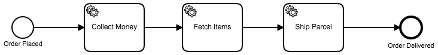

# Zeebe NodeJs Client

Use NodeJs with Zeebe.

## Prerequisites

1. NodeJS >= 8.11
1. Build Tools:

  **On Linux:**

  - GCC
  - make
  - python 2.7

  By default, all of these will be installed on most of the linux system.

  **On Windows:**

    - Visual C++ build Tools
    - python 2.7

    You can install all of these using:

    `npm install --global --production --add-python-to-path windows-build-tools`.

    To know more about this tool visit [this link](https://github.com/felixrieseberg/windows-build-tools).

    💡 [Windows Vista / 7 only] requires .NET Framework 4.5.1

  **On macOS:**

    - xcode & xcode commandline Tools,
    - python 2.7

    By default, python is installed on macOS.
    You should install xcode from App app store.

## Installing

```js
npm install -s zbc-nodejs
```

Or

```js
yarn add zbc-nodejs
```

### Potential issues

💡 If you see the following issue during npm install
```
ld: warning: could not create compact unwind for _ffi_call_unix64: does not use RBP or RSP based frame
```
You might want to run npm install with:
```
LDFLAGS="-Wl,-no_compact_unwind" npm install -s zbc-nodejs
```

## Get Started

This Get Started guide has two parts. First we need to take care of the Basics and then we can start with our NodeJS Clients.

### Basics
In order to use the NodeJS client you will need a running Zeebe Broker.
Also we will need to create a workflow that we want to use with our client.
If you have both you can skip this section and start directly with NodeJS.

#### Make sure you have the Zeebe Broker running.
You can also follow the full install guide in the [Zeebe docs](https://docs.zeebe.io/introduction/install.html#install).

##### a) Docker
```sh
docker run -p 51015:51015 camunda/zeebe:latest
```

##### b) Distribution

In order to run the Distribution, you will need JDK 1.8+.

You can always download the latest Zeebe release from the [Github release page](https://github.com/zeebe-io/zeebe/releases).

Unzip / tar the distribution and start the broker by using
```sh
cd zeebe/bin
./broker
```

Windows users can double-click on the broker.bat file in the bin folder.

#### Create a simple process model (e.g. using [Zeebe Modeler](https://github.com/zeebe-io/zeebe-modeler))

Model a process in Zeebe Modeler that looks like this:



Make sure that the Service Task "Collect Money" has the Task Type "payment-service", the Serice Task "Fetch Items" the Task Type "inventory-service", and the Task "Ship Parcel" has Type "shipment-service".
Also add Input Parameter $.orderId:$.orderId and Output Parameter $.totalPrice:$.totaPrice

If you dont want to model this using the zeebe Modeler, you can also just download the BPMN file that we use in this Guide [here](./examples/zeebe-js-getstarted/order-process.bpmn).

### NodeJS

In this section we actually gonna use NodeJS to work with Zeebe.
It will show you all the basic functionality that you will need.

#### Create a Topic & Workflow

First create a new folder and init a NodeJS project:
```sh
mkdir zeebe-js-getstarted
cd zeebe-js-getstarted
npm init -y
```

Now add the Zeebe NodeJS client dependecy:
```sh
npm install -s zbc-nodejs
```

Next, create a file, e.g. `deployWorkflow.js` and insert the following code:

```js
const { Client } = require('zbc-nodejs')

const myClient = new Client({bootstrapAddr: '0.0.0.0:51015'})

// Create a new topic "get started" with one partition and replicationFactor 1
myClient.createTopic('get-started', 1, 1)

// Create our order workflow that we modeled above
const createWorkflowResult = myClient.createWorkflow('get-started', 'order-process.bpmn')
console.log('Result', createWorkflowResult)
```

You can test your code by saving the file and running:
```sh
node ./deployWorkflow.js
```

In your Terminal you should see something like this:
```
Result { error: '', data: {} }
```

#### Create a Job Worker

Next create a new file, e.g. `paymentService.js` and insert the following code:

```js
const { Client } = require('zbc-nodejs')

const zbClient = new Client({bootstrapAddr: '0.0.0.0:51015'})
zbClient.jobWorker('get-started', 'payment-service', {}, (jobKey, payload) => {

  console.log("The payload", payload)

  // Let's complete the job with some new payload
  const paymentPayload = {'totalPrice':50000}
  zbClient.completeJob(jobKey, paymentPayload)

  // With fail job, you can fail the job.
  // zbClient.failJob(jobKey)
})
```

You can test your code by saving the file and running:
```sh
node ./paymentService.js
```

Leave this application running in the background because we want to see that our worker actually completes Jobs when creating instances in the next section.

#### Create Instances

Next create a new file, e.g. `receiveOrders.js` and insert the following code:

```js
const { Client } = require('zbc-nodejs')

const zbClient = new Client({bootstrapAddr: '0.0.0.0:51015'})

const payload = {'orderNumber':'12345'}
const createInstanceResult = zbClient.createWorkflowInstance('get-started', 'orderProcess', zbClient.LatestVersion, payload)
console.log(createInstanceResult)
```

Success!

You successfully started your workflow instance using NodeJS and implemented your first Job Worker.

<!--- If you got some time, try out to extend your receiveOrders script to actually listen for REST POST requests:

#### Add REST Endpoint for Creating Instances
tbd--->

## Features

Currently following features are implemented:

### Create Topic

```js
var myClient = new Client({bootstrapAddr: "0.0.0.0:51015"});
// Create a topic with topicName, partitionCount, replicationFactor
myClient.createTopic("my-topic", 1, 1);
```

### Create Workflow
```js
var myClient = new Client({bootstrapAddr: "0.0.0.0:51015"});
// Create a Workflow for given BPMN Process
myClient.createWorkflow("my-topic", "myProcess.bpmn");
```

### Create Workflow Instance

```js
var myClient = new Client({bootstrapAddr: "0.0.0.0:51015"});
// Create a Workflow Instance for the BPMN Process 'myProcess' using the latest version (-1) and passing empty payload.
myClient.createWorkflowInstance("my-topic", "myProcess", -1, {});
```

### Create Job Worker

```js
var myClient = new Client({bootstrapAddr: "0.0.0.0:51015"});
myClient.jobWorker("my-topic", "jobTypeXYZ", function(jobKey, payload) {
  // do something with the job
});
```

### Complete Job

```js
var myClient = new Client({bootstrapAddr: "0.0.0.0:51015"});
// Complete Job with given Job Key and passing empty payload.
myClient.completeJob(jobKey, {});
```

### Fail Job

```js
var myClient = new Client({bootstrapAddr: "0.0.0.0:51015"});
// Fail Job with given Job Key.
myClient.failJob(jobKey);
```
